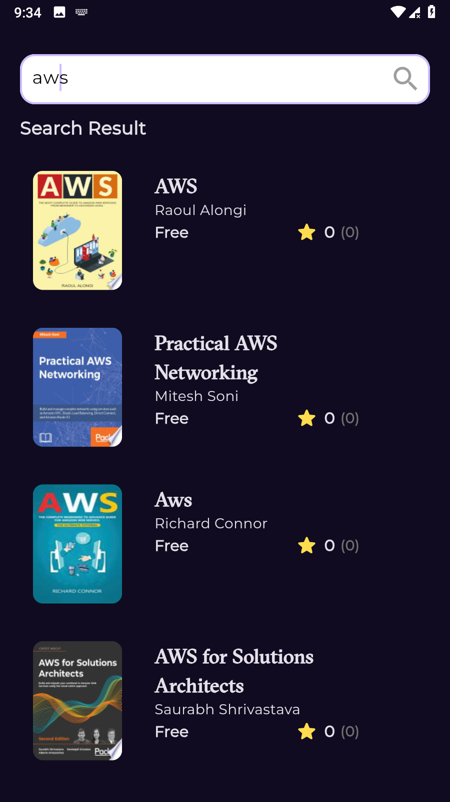

# Bookly - Free Book Discovery App 📚

Bookly is a Flutter-based mobile app that allows users to explore and discover free books using the Google Books API. With a clean and responsive UI, users can search for books, view detailed information, and find similar books based on their preferences. The app leverages modern Flutter practices and state management to deliver a seamless user experience.

## Screenshots 📸




## Features ✨
- **Book Search**: Search for free books by title with a debounced search for a better UX.
- **Featured & Newest Books**: Browse curated lists of popular and recently published free books.
- **Book Details**: View book details including title, ratings, author, and a preview link.
- **Similar Books**: Discover related books based on categories.
- **Responsive UI**: Smooth animations (e.g., splash screen) and a dark theme for enhanced usability.
- **Error Handling**: Robust error management for API failures and network issues.

## Technologies Used 🛠️
- **Flutter**: For building the cross-platform UI.
- **BLoC Pattern**: For state management.
- **Dio**: For making HTTP requests to the Google Books API.
- **go_router**: For navigation between screens.
- **cached_network_image**: For optimized image loading.
- **url_launcher**: To open book preview links in the browser.
- **get_it**: For dependency injection.
- **Google Fonts**: For custom typography.
- **Dartz**: For functional programming (Either type for error handling).

## Setup Instructions 🚀
To run Bookly locally, follow these steps:

### Prerequisites
- Flutter SDK (version 3.x or higher)
- Dart SDK
- Android Studio or VS Code with Flutter extensions
- An active internet connection for API calls

### Installation
1. Clone the repository:
   ```bash
   git clone https://github.com/Mo7medRef3t/bookly.git
   cd bookly


Install dependencies:flutter pub get


Run the app:flutter run


Note: Ensure you have an emulator or physical device connected for testing.
Project Structure 📂
bookly/
├── core/                    # Utilities and shared components
│   ├── constants.dart       # App constants (e.g., colors, fonts)
│   ├── errors/             # Error handling classes
│   ├── utils/              # Helper classes (e.g., ApiService, SizeConfig)
│   └── widgets/            # Reusable widgets (e.g., CustomButton, CustomSearch)
├── features/               # Feature-specific modules
│   ├── home/               # Home screen, book details, and related logic
│   ├── search/             # Search functionality
│   └── splash/             # Splash screen
├── main.dart               # App entry point

Challenges & Solutions 🧠

API Error Handling: Implemented robust error handling using Dio and Dartz to manage network failures gracefully.
Search Debouncing: Added a 500ms debounce to the search input to reduce unnecessary API calls.
Navigation: Used go_router for type-safe navigation and smooth transitions between screens.

Contributing 🤝
Contributions are welcome! Please open an issue or submit a pull request for any improvements or bug fixes.
Contact 📬

GitHub: Mo7medRef3t
LinkedIn: linkedin.com/in/mohamed-refaat-86baa4246
Email: mr6737835@gmail.com

License 📜
This project is licensed under the MIT License.```
